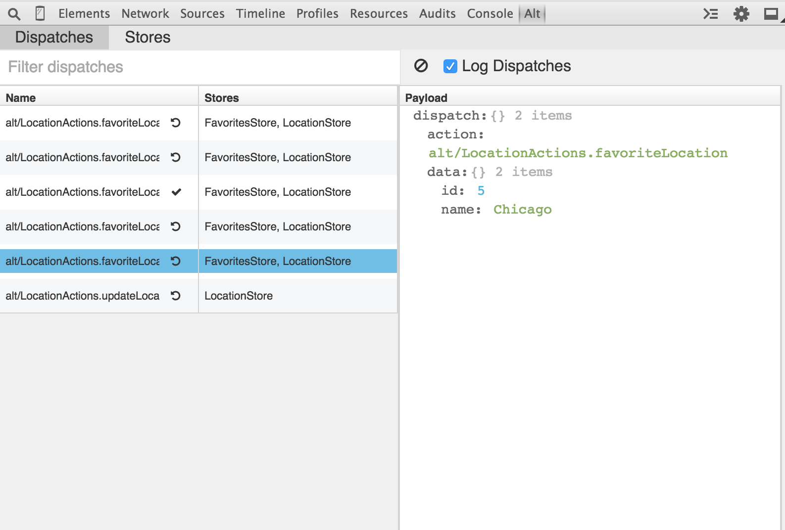
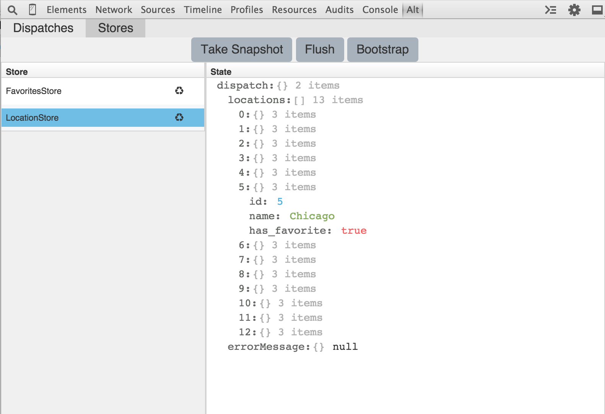

# Alt's Chrome Devtool

> A developer tool extension for debugging your Alt flux applications

Download the extension here:

https://github.com/goatslacker/alt-devtool/raw/master/dist/alt-dev.crx

## Installing

Open up Chrome extensions. Drag the extension onto there. Accept the ridiculous permissions.

In your alt app you'll need to use [chromeDebug](https://github.com/goatslacker/alt/blob/master/src/utils/chromeDebug.js)

```js
var Alt = require('alt');
var alt = new Alt();
Alt.debug('alt', alt);
```


## Permissions

This extension requires the ability to "Read and change all your data on the websites you visit" according to Google.

This extension just needs some JavaScript to detect whether Alt exists on the page or not. Having access to all data on websites you visit is way more power than this extension actually needs to work. Ideally, the extension would just have access to Alt if it exists or not.

The source code will always be included here and the extension as well should you wish to inspect it.


## Feedback

If you have feedback or issues then please [file an issue](https://github.com/goatslacker/alt-devtool/issues).


## Screenshots

All dispatches. Search. Rollback. Time Travel debugging.



Viewing stores. Snapshots. Bootstrap. Flush.




## Building this yourself

* Clone this repo to your computer
* You might need to `npm install` and `npm run build`
* Download [Chrome Apps & Extensions Developer Tool](https://chrome.google.com/webstore/detail/chrome-apps-extensions-de/ohmmkhmmmpcnpikjeljgnaoabkaalbgc) from the chrome store.
* Open the Extensions dev tool you just downloaded and click on the `Extensions` tab
* Click `Load Unpacked` and find the folder where you cloned alt-devtool
* Open it
* Remove `node_modules` folder from your directory (you technically don't have to but this is faster)
* Click `pack`
* You'll need to use a private key, you can generate your own or not use one I think
* You'll finally have a .crx file which you can then install


## License

[MIT](http://josh.mit-license.org)
